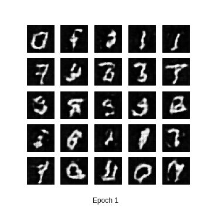

# AI6 : Session 16
---
## Morning Session

- **RECAP : Image Segmentation** [link](https://github.com/AI6-Bangalore-Chapter/2018-cycle-2/tree/master/Sessions/Session_15)
- [DCGAN](https://colab.research.google.com/drive/1XxSO_JAzZWjXLTaQyAPmhupooHJVtoWo)
- 
---
## Afternoon Session

- [pytorch](https://pytorch.org/)
- [official tutorial](https://pytorch.org/tutorials/advanced/cpp_export.html)
- [Github Repo : code](https://github.com/Sharwon/cpp-torch-cpu)
- [Colab link if you dont have proper setup in local cpu pc](https://colab.research.google.com/drive/1A7NTVY4042AD08kaKCOzwKb90FOxmF_M)
